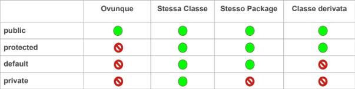

# Garbege collector
Strumento utilizzato per la gestione dell memoria.
Il garbage colector traccia le variabili inutilizzate e le distrugge in quanto non più necessarie.

# Le classi
La classe è un **tipo di dato complesso**, definisce le caratteristiche di un oggetto. Posso avere più oggetti dello stesso tipo, tutti diversi tra loro (dal punto di vista delle caratteristiche) ma tutti saranno **istanze della classe**.
Un oggetto in Java può esistere solo se esiste la relativa classe. La creazione dell'oggetto è chiamata: istanza della classe. Un **oggetto** è un'istanza di una classe.

# I metodi 
I metodi sono un insieme di istruzioni racchiuse in un unico blocco: rendono i programmi più leggibili e di più facile manutenzione, lo sviluppo più veloce e stabile, evitando le duplicazioni e favoriscono il riuso di codice.
## dichiarazione di un metodo
[modificatori] tipo_di_ritorno nome_metodo ([parametri]){
    corpo_del_metodo
}
* Modificatori: parole chiave di Java utilizzate per modificare le funzionalità, le caratteristiche, la visibilità di un metodo (public o private);
* Tipo di ritorno: è il tipo del dato che un metodo può resituire al termine della sua esecuzione. Quando il metodo non restituisce nulla il tipo è dichiarato **void** come nel caso del metodo main;
* Nome del metodo: identificatore;
* Parametri: variabili che potranno essere passate al metodo in input e sfruttare nel corpo del metodo. OSS: nome metodo e parametri costituiscono la **firma del metodo**.
* Corpo del metodo: l'insieme di istruzioni che verranno eseguite all'invocazione del metodo.

# Differenza tra Override e Overload in Java
In Java, l'override e l'overloading sono due meccanismi fondamentali che permettono di definire metodi con lo stesso nome, ma con funzionalità distinte.
## Overloading (Sovraccarico)
### Definizione
L'overloading si verifica quando una classe contiene più metodi con lo stesso nome, ma con *firme* diverse. La firma di un metodo è determinata dal numero, dal tipo e dall'ordine dei suoi parametri.
## Override (Sovrascrittura)
### Definizione
L'override si verifica quando una sottoclasse (classe derivata) fornisce una specifica implementazione di un metodo che è già definito nella sua superclasse (classe base).
Il metodo nella sottoclasse deve avere la stessa firma del metodo nella superclasse.
# Differenze riassuntive
1. Dove avviene: 
    * Overloading: all'interno della stessa classe;
    * Override: tra una superclasse e una sottoclasse.
1. Firma del metodo:
    * Overloading: la firma deve essere diversa;
    * Override: la firma delle essere identica.
1. Scopo principale:
    * Overloading: fornire metodi con funzionalità simili ma input diversi;
    * Override: personalizzare il comportamento ereditato.
In Java, l'annotation @Override può essere utilizzata per indicare esplicitamente che un metodo intende sovrascrivere un metodo della superclasse. Questo aiuta a prevenire errori, poiché il compilatore segnalerà se il metodo non sovrascrive effettivamente nulla.

# Il metodo costruttore
Particolare metodo cone le seguenti caratteristiche:
* ha lo stesso nome della classe;
* non ha tipo di ritorno;
* è chiamato automaticamente (e solamente) ogni volta che è istanziato un oggetto;
* è presente in ogni classe;
* solatamente un metodo costruttore viene definito allo scopo di inizializzare le variabili d'istanza.
```java 
public class Punto{
    //metodo costruttore
    public Punto(){
        System.out.println("Costruito un Punto!");
    }
    public int x;
    public int y;
} 
```
# This
Utilizaato all'interno di metodi o costruttori fa riferimento all'oggetto corrente, andando a risolvere problemi di ambiguità nella definizione dei parametri.
### esempio
```java
public class Cliente {
    private String nome, indirizzo, numeroDiTelefono;

    public void setDati (String nome, String indirizzo,String numeroDiTelefono){

    this.nome = nome;
    this.indirizzo = indirizzo;
    this.numeroDiTelefono = numeroDiTelefono;
    }
}
```

# Modificatori
I modificatori sono keyword di Java. Scritto prima di un qualsiasi componente (variabile, classe, metodo) è in grado di cambiare la visibilità e l'accesso.
* **public**: può essere utilizzato su classi, metodi e variabili d'istanza. Visibilità:
    * le classi sono visibili in qualsiasi package del progetto;
    * i metodi e le variabili sono visibili da qualsiasi classe in qualsiasi package.
* **protected**: può essere utilizzato su metodi e variabili d'stanza, leggermente più restrittivo del public. Visibilità:
    * i metodi o le variabili definite protected sono visibili da qualsiasi classe all'interno dello stesso package e da tutte le sottoclassi.
* **default** (senza modificatore): Visibilità:
    * una classe senza modificatore è visibile solo dalle classi dello stesso package;
    * i metodi e le variabili sono visibili solo dalle classi dello stesso package della classe che li definisce.
* **private**: può essere utilizzato su metodi e variabili di istanza. Rappresenta il modificatore più restrittivo. Visibilità: 
    * i metodi o le variabili definite private sono visibili solo all'interno della classe che li definisce -> **metodi Getters & Setters**



# Altri modificatori
* **final**: può essere utilizzato su classi, metodi e variabili. Questo modificatore indica che la caratteristica non può essere modificata. Comportamento:
    * una **classe** definita final non può essere estesa;
    * un **metodo** non può essere sovrascritto;
    * un **attributo** è una costante.
* **static**: può essere utilizzato su metodi e variabili. Gli elementi static **appartengo solo alla classe che li definisce**, non appartengono all'oggetto:
    * un elemento static può essere utilizzato anche senza l'istanza dell'oggetto che lo contiene;
    * un metodo static non può accedere a elementi non static, potrebbero non esistere in memoria.

# Paradigmi fondamentali 
## Incapsulamento 
Questa tecnica consente di nascondere il funzionamento interno di una porzione di programma. Nella OOP l'incapsulamento prevede che:
* gli attributi siano visibili solo internamente all'oggetto (visibilità **private**);
* l'accesso agli attributi deve avvenire solo attraverso dei metodi public (**Getters & Setters**).
Principio dell’ Information Hiding ti dico cosa ma non ti dico come. L’aspetto importante è come assemblare i vari elementi, dandoci delle interfacce per permettere l’assemblaggio ma non come è fatto un determinato oggetto.

## Ereditarietà
Questa tecnica consente di **estendere** le caratteristiche di una classe ad un’altra classe. Questi attributi sono quindi utilizzabili dalla nuova classe che **eredita**. Si parla di attributi e metodi definiti public o protected, quelli private non possono essere ereditati.
Quando una classe eredita può:
* definire i suoi metodi e attributi;
* ridefinire quelli della classe da cui eredita (meccanismo dell'overriding), keyword **extends**
### esempio 
public class ClasseB extends ClasseA{
    ...
}

## Polimorfismo
Questa tecnica consente di ridefinire dei metodi già definiti in altre classi. Il polimorfismo è valido **solo su classi in cui è implementata l'ereditarietà**.
Con l'annotation @Override comunico alla JVM che sto sovrascrivendo il metodo della classe genitore da cui lo sto ereditando.