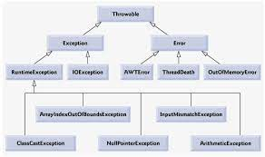

# Eccezioni 
## Schema eccezioni 


### Exception
Le Exception dipendono dal codice che ha scritto il programmatore.  
Vengono gestite con un try-catch.  
La classe generale delle eccezioni è **Exception**, ma quella di base è **RuntimeException**

### Error
Gli Error non dipendono dal codice ma sono errori dovuti al sistema, oppure ad un malfunzionamento della JVM


```java
import java.io.File;
import java.io.FileNotFoundException;
import java.io.FileReader;

public class Main {
	public static void main(String[] args) {
		
		File f = new File("./testo.txt"); //sto appositamente sbagliando il nome del file
//		System.out.println(f.exists());
		
		//Uso il fileReader
		try {
			//Mi viene suggerito di circondare con un try-catch proprio perchè parliamo di Eccezioni di tipo CHECKED
			FileReader fr = new FileReader(f);
//			System.out.println("Il file esiste");
		} catch (FileNotFoundException e) {
			e.printStackTrace();
		}
		
		//Esempio di Eccezione UNCHECKED. Queste le posso gestire senza try-catch
//		try {
//			stampaTesto(null);
//		} catch (NullPointerException e) {
//			System.out.println("Stai utilizzando un testo nullo");
//		}
//		dividi(0);
		
//		esegui(null);
		esegui2(null);
	}
	
	//ECCEZIONE UNCHECKED GESTITA ATTRAVERSO UN IF
//	private static void stampaTesto(String testo) {
//		if(testo != null) {
//			String tmp = testo.concat("....");
//			System.out.println(tmp);
//		}else {
//			System.out.println("Mi hai passato un testo vuoto");
//		}
//	}
	
	//ECCEZIONE GESTITA ATTRAVERSO UN TRY-CATCH
//	private static void stampaTesto(String testo) {
//		try {
//			String tmp = testo.concat("....");
//			
//			int val = 10;
//			if(testo != null && testo.length() < val) {
//				System.out.println("Il tuo testo ha meno di " + val + " caratteri");
//			}else {
//				System.out.println(tmp);
//			}
//		} catch (Exception e) {
//			// TODO: handle exception
//			System.out.println("Guarda che mi stai passando un testo vuoto");
//			//System.out.println(e); //gestire/Handle the exception
//		}finally { //gestito anche se va in errore, sempre eseguito
//			System.out.println("Il finally verrà sempre eseguito");
//		}
//	}
	
//	private static void dividi(int numero) {
//		int mioNumero = 5;
//		try {
//			int divisione = mioNumero / numero;
//			System.out.println(divisione);
//		} catch (ArithmeticException e) {
//			// TODO Auto-generated catch block
//			System.out.println("Bello, stai dividendo per 0");
//		}
//	}
	
	//ALTRO MODO DI GESTIRE LE ECCEZIONI --- THROWS
	//Con il throws sto demandando chi eseguirà questo metodo la gestione attraverso un try-catch
	private static void stampaTesto(String testo) throws NullPointerException{
		
		String tmp = testo.concat("....");
		System.out.println(tmp);
	}
	
	private static void esegui(String testo) {
		try {
			stampaTesto(testo);
		} catch (NullPointerException e) {
			// TODO Auto-generated catch block
			e.printStackTrace();
		}  
	}
	
	//Con eccezioni personalizzate
	private static void stampaTesto2(String testo) throws MiaEccezione {
		if(testo == null) {
			throw new MiaEccezione(); //stiamo istanziando per ottenere i metodi personalizzati
		}
	}
	
	public static void esegui2(String testo) {
		try {
			stampaTesto2(testo);
		} catch (MiaEccezione miaE) {
			String msg = miaE.getMessage();
			String dettagli = miaE.dettagliEccezione();
			System.out.println(msg);
			System.out.println(dettagli);
			miaE.printStackTrace();
		} catch(Exception e){
			System.out.println("Si è verificata un'eccezione generalizzata");
		} finally {
			System.out.println("Questo verrà sempre eseguito");
		}
	}
	
}
```